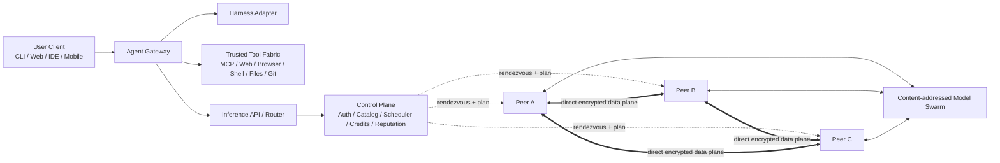
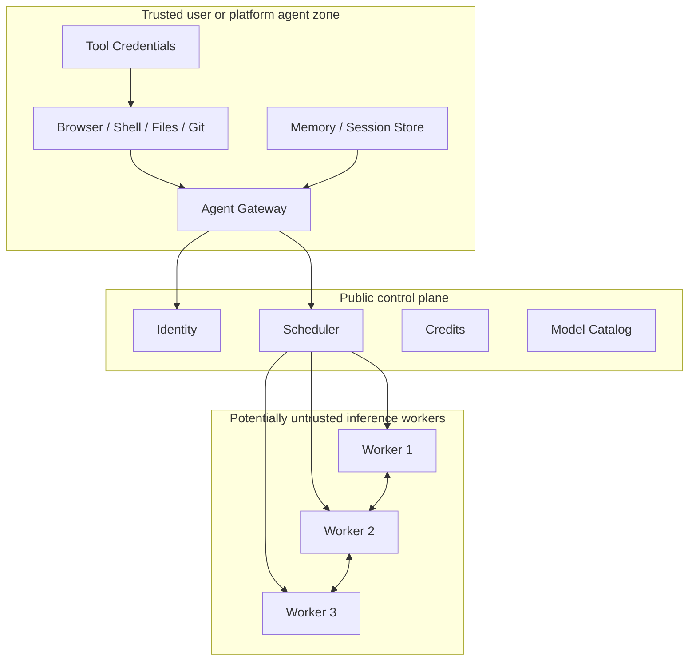
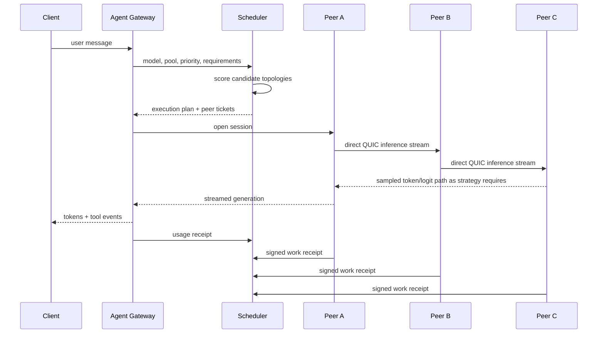

# MeshCompute Architecture

## High-level system



The dashed control-plane links carry metadata and planning.

The peer links carry the inference data path.

## Trust zones



Secrets remain in the trusted agent zone.

## Request lifecycle



## Core services

### Control plane

Stateless API where possible, durable state in PostgreSQL.

Owns:
- accounts,
- node identities,
- model manifests,
- pool membership,
- scheduling metadata,
- credits,
- reputation,
- signed execution plans,
- signed work receipts,
- coarse telemetry.

It should be horizontally scalable and must not carry the bulk activation stream.

### Scheduler

Consumes:
- node capabilities,
- peer topology,
- shard availability,
- queue state,
- model strategy support,
- user credit/priority,
- pool policy.

Outputs a versioned execution plan.

The execution plan must be reproducible enough to explain why a request was placed on specific peers.

### Node daemon

Responsibilities:
- peer identity,
- discovery,
- NAT traversal,
- QUIC streams,
- relay fallback,
- telemetry,
- resource policy,
- model cache,
- shard distribution,
- runtime process management,
- signed work receipts.

The node daemon should not contain agent credentials.

### Inference runtime

Separate process boundary from the node daemon.

Responsibilities:
- load model shard,
- run assigned blocks/experts/tensors,
- own relevant KV cache,
- serialize/deserialize activation packets,
- enforce memory limits,
- expose measured performance,
- clean up on cancellation.

### Agent gateway

Responsibilities:
- session orchestration,
- harness adapters,
- prompt/context,
- tools,
- approvals,
- web,
- MCP,
- ACP,
- memory,
- citations,
- calls to inference API.

## Scheduling cost model

A candidate execution plan should estimate:

```text
predicted_total_latency =
    queue_delay
  + shard_load_delay
  + prefill_compute
  + prefill_network
  + decode_compute
  + decode_network
  + reliability_penalty
```

Use real measurements and calibrate prediction error over time.

A path with more GPUs can lose if every token crosses a 70 ms WAN hop.

The system should learn this rather than encode simplistic rules.

## Failure model

Peers can:
- disappear,
- throttle,
- lie,
- return invalid data,
- run out of VRAM,
- suffer thermal throttling,
- change network,
- lose relay connectivity.

Execution plans must specify failure behavior:
- retry same peer,
- bypass peer,
- rebuild path,
- restart generation from checkpoint,
- fail session cleanly.

Phase 1 may restart generation if mid-token-path recovery is too complex. Do not fake seamless recovery.

## Model placement

Each peer advertises cached content hashes.

The scheduler prefers:
1. warm compatible shards,
2. high-reliability peers,
3. topology-compatible peers,
4. peers likely to remain available.

Cold-loading a model can dominate interactive latency, so shard placement is part of scheduling.

## Data-plane packet classes

Keep protocol classes distinct:
- control signal,
- activation tensor,
- KV-cache operation,
- token/logit result,
- model chunk,
- telemetry,
- cancellation,
- work receipt.

Large tensor payloads should not be serialized through JSON.

Use versioned binary framing.
